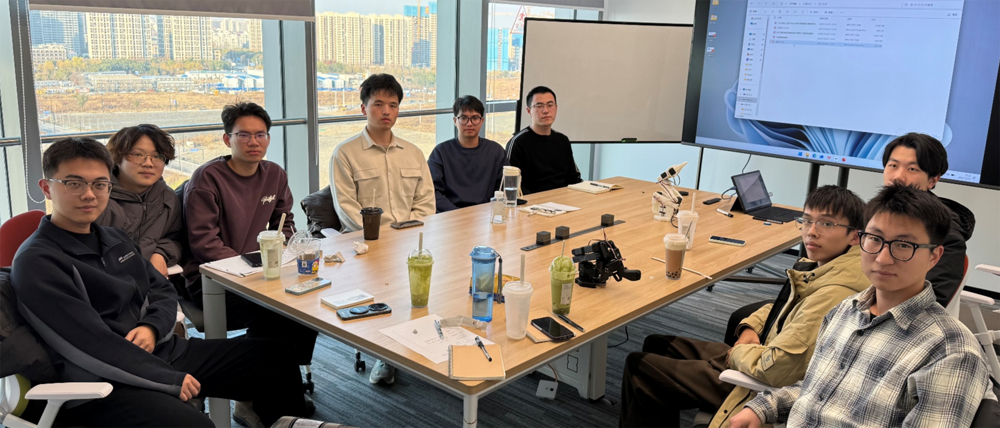

➡️ <a href="https://xianchaoxiu.github.io/group/reading/" class="textlink" target="_blank"> 每年招收硕士研究生 2 名 </a> 

### PhD Students
* TBD

### Master's Students
* Zishu Zhang (2027.09-)  
* Muping Sun (2027.09-)  
* Bingwen Zhang (2026.09-)  
* Yewen Hu (2026.09-)  
* Li Xu (2025.09-)  
* Pengfei Zhang (2025.09-)  
* Jianhao Li (2024.09-)  
* Long Chen (2024.09-)  
* Chenyi Huang (2023.09-2026.06)  
* Anning Yang (2022.09-2025.06)  
* Fuchao Yu (2021.09-2024.06)  

### Cooperant Students
* Chong Shen (2024.09-)  
* Changhua He (2024.09-)  
* Shenghao Sun (2023.09-2026.06)  
* Shiqi Fei (2023.09-2026.06)  

 
<em>2025年, 南大研究院</em>

